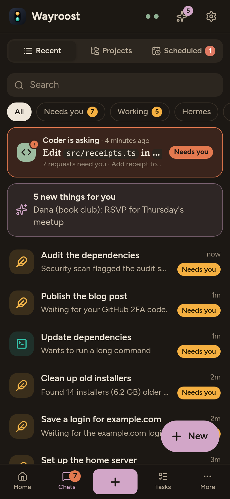
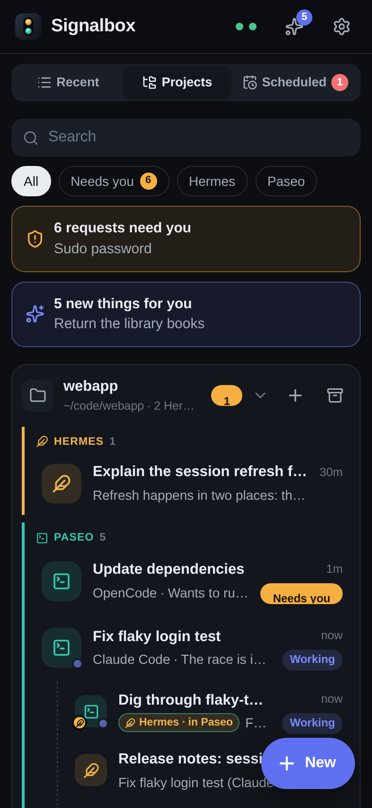

# Wayroost

Your own AI team, on your own PC: one open-source home for your personal and coding agents, reachable from your phone.

**Status: early development.** Wayroost starts from Signalbox, a self-hosted web app that puts [Hermes Agent](https://github.com/NousResearch/hermes-agent) chats and [Paseo](https://github.com/getpaseo/paseo) coding agents into one phone-friendly interface. The code here is that app today. Its guide is in [docs/signalbox.md](docs/signalbox.md). This page describes where Wayroost is going.

<p>
  
  
</p>

## What Wayroost will be

- **One home for your agents.** A Windows app, with a matching phone web app, for running, managing and talking to your AI agents. It brings together Hermes Agent, a personal assistant with memory, skills and messaging, and Paseo, which runs coding agents such as Claude Code, Codex, OpenCode and pi.
- **A team, not a single chatbot.**
  - A **Manager** at the front door turns requests into tasks, hands them to the right agent, follows up and only reports "done" with evidence.
  - A hands-on **Agent** does research, browsing and desktop work.
  - A **Coder** runs coding workers, and a **Reviewer** checks the results.
  - A **Scout** handles proactive checks, and **Voice** handles calls.
- **It runs itself.** Wayroost installs and supervises everything: models, agents and services start on their own, restart when they crash, and switch models in one step. There are two install modes:
  - Windows with its own Linux (WSL2), for the fastest local models on NVIDIA GPUs;
  - Windows only.
- **One set of settings** for models, agents, skills, connectors, memory, automations, safety and access. Each setting writes into the configuration of the tool it belongs to; there's no third copy.
- **Local first.** Your models and your data stay on your machine. Cloud models (API keys or subscriptions) are optional.
- **Reach it your way.** Talk to your agents from the app, WhatsApp, Telegram, a real phone line or in-car voice.
- **Safe by default.** Approvals for risky actions, restricted scheduled jobs, keys in the operating system's key store, and no telemetry.
- **Remote access** through Tailscale, your own Cloudflare Tunnel, or an optional hosted relay with end-to-end encryption. The app is free and open source.

## Roadmap

| Milestone | Delivers |
|---|---|
| M0 | This repository, licence and CI (done) |
| M1 | The desktop app and the supervisor; device pairing |
| M2 | Unified settings and the agent team |
| M3 | The installer and Wayroost's own Linux distro |
| M4 | Importing an existing Hermes and Paseo setup |
| M5 | Windows-only mode |
| M6 | Remote access: Tailscale and Cloudflare |
| M7 | Channels and add-ons: WhatsApp, Telegram, phone line |
| M8 | The remaining settings: connectors, memory, devices, projects |
| M9 | Look and feel; signed 1.0 release |
| M10 | The optional hosted relay |

## Build and test

You need Node.js 22. Chrome is used for the UI check.

```bash
npm ci
npm run typecheck
npm test
npm run check:ui   # screenshots of every screen, against demo data
npm run demo       # the app with demo data, no agents needed
```

## Contributing, security and licence

- [CONTRIBUTING.md](CONTRIBUTING.md) explains how to work on the code.
- [SECURITY.md](SECURITY.md) explains how to report a vulnerability.
- Wayroost is licensed under [Apache-2.0](LICENSE); see [NOTICE](NOTICE).
- It works with Hermes Agent and Paseo but isn't affiliated with Nous Research or the Paseo project.
